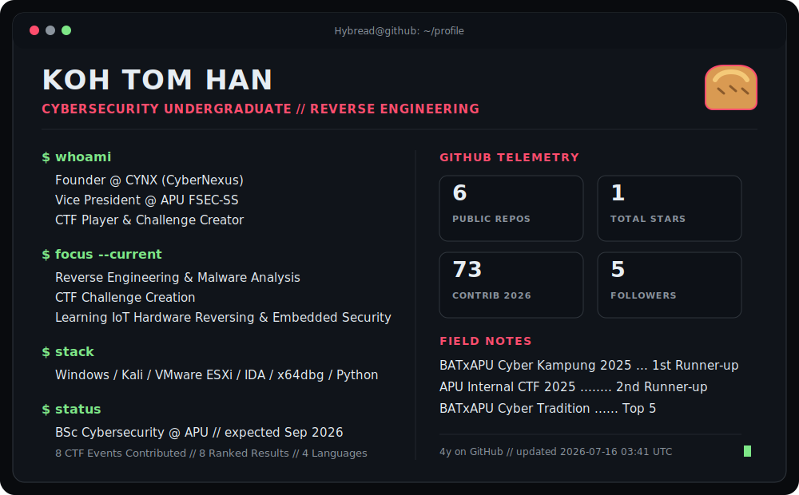

<picture>
  <source media="(prefers-color-scheme: dark)" srcset="./assets/profile-dark.svg">
  <source media="(prefers-color-scheme: light)" srcset="./assets/profile-light.svg">
  
</picture>

## `about.me`

Cybersecurity undergraduate at **Asia Pacific University (APU)** focused on **reverse engineering, malware analysis, digital forensics and practical security testing**. Founder of **CYNX (CyberNexus)**, Vice President of **APU FSEC-SS**, and a CTF challenge creator who messes around with 0's and 1's.

```python
current_objectives = [
    "reverse engineer binaries and malwares for fun",
    "build CTF challenges and cope when AI one shots it",
    "simulate CVEs in isolated environments for self research ",
    "trying to find a job 🥀",
]
```

### My Experience (so far)

| Area | Summary |
|---|---|
| Security Consulting Intern | XDR and endpoint testing, virtual labs, attack simulation, vulnerability testing, malware research and NGFW evaluation |
| CTF Events | Reverse-engineering challenges delivered across many CTF competitions, both locally and internationally |
| Competition | Some podiums once in a blue moon but mainly playing to learn more reversing techniques |
| Leadership | Founder of CYNX and Vice President of APU FSEC-SS |

### Connect

[LinkedIn](https://www.linkedin.com/in/koh-tom-han) · [CYNX](https://cynx.fun)

<sub>Btw my profile card is regenerated daily by <code>today.py</code> through GitHub Actions.</sub>
